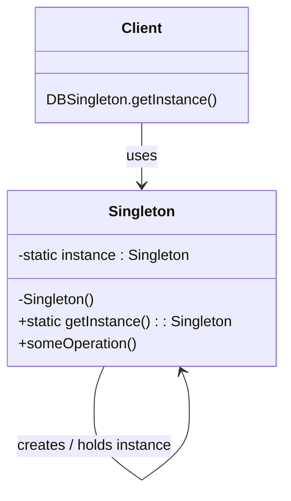

# Singleton Pattern

Ensures that class can have only one instance at a same time.

```mermaid
classDiagram
class Singleton {
    -static instance : Singleton
    -Singleton()
    +static getInstance() : Singleton
    +someOperation()
}

class Client {
    DBSingleton.getInstance()
}

Singleton --> Singleton : creates / holds instance
Client --> Singleton : uses
```
